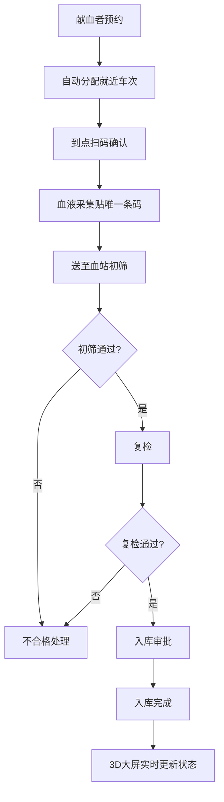

## 1. 产品概述

3D智慧城市流动献血车调度与血库联动可视化平台，通过三维数字孪生技术实现城市献血资源的智能调度与可视化管理。平台覆盖城市主要商圈、社区献血点、固定血站及急救中心，实现献血车实时定位、库存监控、智能调度、血液审批全流程可视化。

- 核心价值：提升献血调度效率，保障血液供应安全，实现血液采集-检测-入库全流程可追溯
- 目标用户：血站主任、护士、献血者三级用户体系

## 2. 核心功能

### 2.1 用户角色

| 角色 | 登录方式 | 核心权限 |
|------|----------|----------|
| 献血者 | 人脸识别/账号登录 | 在线预约、查看分配车次、个人献血记录 |
| 护士 | 人脸识别/账号登录 | 扫码确认、采集操作、设备状态查看 |
| 血站主任 | 人脸识别/账号登录 | 全局调度、审批管理、数据统计、日报导出 |

### 2.2 功能模块

1. **3D城市大屏**：城市建筑模型、献血车实时位置、血站/急救中心标记、路径动画
2. **献血车管理**：车辆信息展示、库存监控、设备状态、采集记录
3. **智能调度**：库存阈值预警、自动生成采血计划、最优路径规划、通知推送
4. **预约系统**：在线预约、自动分配就近车次、扫码确认
5. **血液审批**：初筛-复检-入库三级审批、状态实时追踪
6. **数据统计**：采集量统计、血型分布、异常事件、Excel导出
7. **权限管理**：三级用户分级、人脸识别登录、操作日志

### 2.3 页面详情

| 页面名称 | 模块名称 | 功能描述 |
|---------|---------|----------|
| 登录页 | 人脸识别登录 | 人脸采集、身份验证、角色选择、操作日志记录 |
| 3D大屏主页 | 城市三维场景 | 城市建筑模型、昼夜效果、地图漫游、缩放旋转 |
| 3D大屏主页 | 献血车标记 | 车辆编号、位置、血型库存、预约人数、悬浮信息卡 |
| 3D大屏主页 | 路径动画 | 绿色调度路径、车辆移动动画、实时位置追踪 |
| 3D大屏主页 | 点位标记 | 血站、急救中心、社区献血点、商圈标记 |
| 车辆详情面板 | 设备状态 | 采血设备、冷藏设备、电源设备运行状态监控 |
| 车辆详情面板 | 采集记录 | 近24小时采集记录、献血者信息、血型统计 |
| 预约页面 | 在线预约 | 选择时间地点、自动分配就近车次、预约确认 |
| 审批页面 | 三级审批 | 初筛-复检-入库审批流程、状态流转、审批记录 |
| 统计报表 | 数据统计 | 各车采集量、血型分布、异常事件统计图表 |
| 统计报表 | 日报导出 | 采血日报Excel导出、自定义时间范围 |

## 3. 核心流程

### 3.1 智能调度流程

当某血型库存低于安全阈值时，系统自动触发调度流程：
1. 检测库存低于阈值 → 2. 分析人流密集区域 → 3. 查找最近可用献血车 → 4. 生成调度计划 → 5. 推送通知至血站主任 → 6. 车辆出发（绿色路径动画） → 7. 到达目的地开始采血

### 3.2 血液采集审批流程

1. 献血者预约 → 2. 自动分配车次 → 3. 到点扫码确认 → 4. 血液采集贴条码 → 5. 送至血站初筛 → 6. 复检 → 7. 入库 → 8. 状态实时更新至3D大屏

## 4. 用户界面设计

### 4.1 设计风格

- **主色调**：深海蓝（#0A1628）为背景主色，医疗红（#E63946）为强调色，生命绿（#2ECC71）为安全/通过色
- **辅助色**：金色（#F1C40F）表示预警，科技蓝（#3498DB）表示信息
- **设计风格**：科技感大屏风格、深色主题、霓虹光效、玻璃拟态面板
- **字体**：标题使用 Orbitron（科技感字体），正文使用 Noto Sans SC
- **图标风格**：线性图标，带发光效果
- **动效**：平滑过渡、脉冲光晕、路径流动动画

### 4.2 页面设计概述

| 页面名称 | 模块名称 | UI元素 |
|---------|---------|--------|
| 登录页 | 人脸识别登录 | 深色背景、人脸采集框、发光扫描线、角色选择卡片 |
| 3D大屏主页 | 城市三维场景 | 深色夜空背景、建筑发光轮廓、粒子效果、动态水面 |
| 3D大屏主页 | 献血车标记 | 发光车辆图标、悬浮信息卡、脉冲光环、库存进度条 |
| 车辆详情面板 | 设备状态 | 玻璃拟态面板、状态指示灯、实时数据波形图 |
| 车辆详情面板 | 采集记录 | 时间线布局、血型标签、数据统计卡片 |
| 审批页面 | 三级审批 | 流程时间线、状态徽章、审批人信息、操作按钮 |
| 统计报表 | 数据统计 | 柱状图、饼图、折线图、数据卡片网格 |

### 4.3 响应性

- 桌面端优先设计（1920×1080及以上）
- 支持大屏展示（2K/4K自适应）
- 平板端适配：面板堆叠布局
- 移动端：简化3D视图，保留核心数据展示

### 4.4 3D场景指南

- **环境**：夜晚城市风格，深蓝色天空，星星粒子，建筑窗户发光
- **光照**：环境光 + 方向光模拟月光，建筑边缘霓虹光效
- **相机**：透视相机，支持鼠标拖拽旋转、滚轮缩放、右键平移
- **构图**：城市鸟瞰视角，献血车和重点建筑为视觉焦点
- **交互**：点击建筑/车辆显示详情面板，悬停显示简要信息
- **后处理**：辉光效果（Bloom）、轻微泛光、色调映射
- **性能**：使用实例化渲染优化建筑，LOD层级细节，目标帧率60fps
