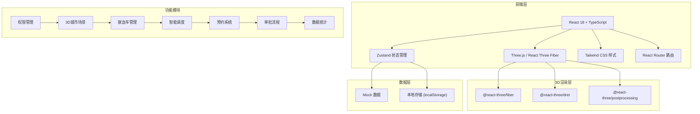

## 1. 架构设计



## 2. 技术描述

- **前端框架**: React 18 + TypeScript
- **构建工具**: Vite 5
- **3D渲染**: Three.js + @react-three/fiber + @react-three/drei + @react-three/postprocessing
- **状态管理**: Zustand
- **样式方案**: Tailwind CSS 3
- **路由管理**: React Router DOM 6
- **图标库**: Lucide React
- **图表库**: Recharts
- **Excel导出**: SheetJS (xlsx)
- **后端**: 无后端，使用 Mock 数据模拟
- **数据存储**: localStorage 持久化

## 3. 路由定义

| 路由 | 页面 | 说明 |
|------|------|------|
| `/login` | 登录页 | 人脸识别登录、角色选择 |
| `/dashboard` | 3D大屏主页 | 城市3D场景、全局概览 |
| `/vehicles` | 献血车管理 | 车辆列表、详情、设备状态 |
| `/appointment` | 预约管理 | 在线预约、分配车次 |
| `/approval` | 审批中心 | 初筛-复检-入库三级审批 |
| `/statistics` | 统计报表 | 数据统计、日报导出 |

## 4. 数据模型

### 4.1 核心数据类型

```typescript
// 献血车
interface BloodVehicle {
  id: string;
  number: string;
  position: { x: number; y: number; z: number };
  targetPosition?: { x: number; y: number; z: number };
  status: 'idle' | 'moving' | 'collecting' | 'maintenance';
  inventory: {
    A: number;
    B: number;
    O: number;
    AB: number;
  };
  reservationCount: number;
  devices: Device[];
  collectionRecords: CollectionRecord[];
}

// 设备
interface Device {
  id: string;
  name: string;
  type: 'collection' | 'refrigeration' | 'power';
  status: 'normal' | 'warning' | 'error';
  lastCheck: string;
}

// 采集记录
interface CollectionRecord {
  id: string;
  donorId: string;
  donorName: string;
  bloodType: 'A' | 'B' | 'O' | 'AB';
  volume: number;
  barcode: string;
  collectionTime: string;
  vehicleId: string;
}

// 血站/献血点
interface BloodStation {
  id: string;
  name: string;
  type: 'station' | 'donation_point' | 'emergency_center' | 'mall';
  position: { x: number; y: number; z: number };
  inventory?: {
    A: number;
    B: number;
    O: number;
    AB: number;
  };
}

// 血液审批
interface BloodApproval {
  id: string;
  barcode: string;
  donorName: string;
  bloodType: string;
  volume: number;
  currentStage: 'initial_screening' | 'recheck' | 'storage';
  stages: {
    name: string;
    status: 'pending' | 'processing' | 'passed' | 'failed';
    operator?: string;
    time?: string;
    remark?: string;
  }[];
  createTime: string;
}

// 用户
interface User {
  id: string;
  name: string;
  role: 'donor' | 'nurse' | 'director';
  avatar?: string;
  lastLogin: string;
}

// 预约
interface Appointment {
  id: string;
  donorId: string;
  donorName: string;
  vehicleId: string;
  time: string;
  status: 'pending' | 'confirmed' | 'completed' | 'cancelled';
}
```

### 4.2 数据结构设计

- **Mock 数据目录**: `src/data/mock/`
- **类型定义**: `src/types/`
- **状态管理**: `src/store/`

## 5. 项目结构

```
src/
├── components/          # 通用组件
│   ├── ui/             # 基础UI组件
│   ├── three/          # 3D相关组件
│   └── panels/         # 面板组件
├── pages/              # 页面组件
│   ├── Login/
│   ├── Dashboard/
│   ├── Vehicles/
│   ├── Appointment/
│   ├── Approval/
│   └── Statistics/
├── store/              # Zustand 状态管理
│   ├── useAuthStore.ts
│   ├── useVehicleStore.ts
│   └── useApprovalStore.ts
├── data/               # Mock 数据
│   ├── vehicles.ts
│   ├── stations.ts
│   └── users.ts
├── types/              # TypeScript 类型定义
│   └── index.ts
├── utils/              # 工具函数
│   ├── excel.ts
│   └── helpers.ts
├── hooks/              # 自定义 Hooks
│   ├── useAnimation.ts
│   └── useThreeScene.ts
├── App.tsx
├── main.tsx
└── index.css
```

## 6. 核心技术方案

### 6.1 3D 场景实现

- 使用 `@react-three/fiber` 声明式构建 Three.js 场景
- 使用 `@react-three/drei` 提供的辅助组件（OrbitControls、Text、Stars 等）
- 建筑使用程序化生成，结合实例化渲染优化性能
- 路径动画使用 TWEEN.js 或自定义插值函数
- 后期处理使用 `@react-three/postprocessing` 实现 Bloom 效果

### 6.2 状态管理

- 使用 Zustand 管理全局状态
- 按模块划分 store（auth、vehicle、approval 等）
- 使用 persist 中间件实现 localStorage 持久化

### 6.3 样式方案

- Tailwind CSS 原子化样式
- 自定义主题配置（颜色、字体、间距）
- 玻璃拟态效果使用 backdrop-blur + 半透明背景

### 6.4 性能优化

- 3D 场景使用 InstancedMesh 渲染重复建筑
- 贴图压缩和纹理复用
- React 组件使用 memo 优化重渲染
- 数据使用 useMemo/useCallback 缓存
